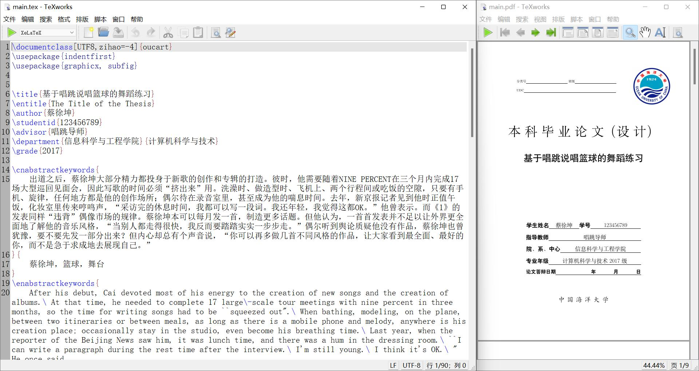
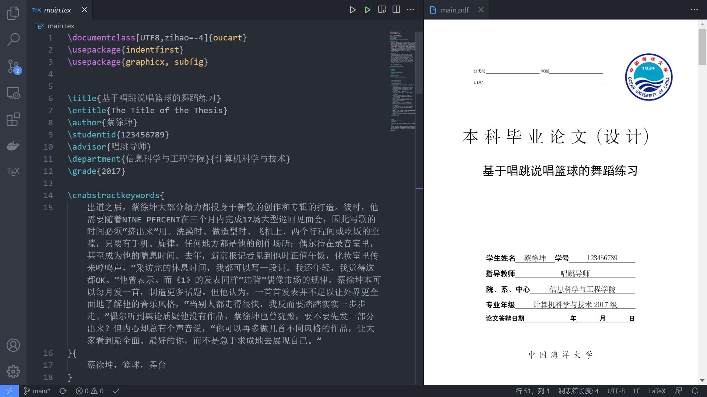
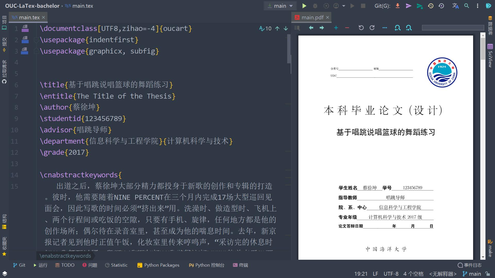
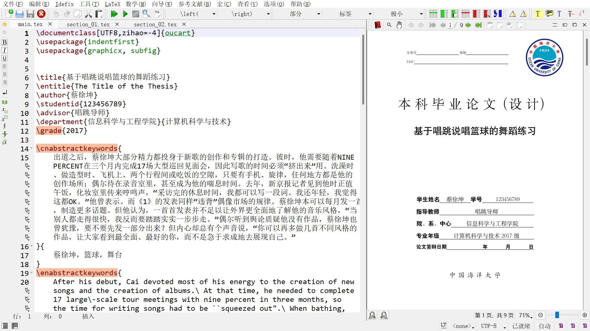

## 简介 

本模板是中国海洋大学本科生毕业论文LaTeX模板。LaTeX是一个流行的编辑科学类文章的工具。 大多数科学类书籍，期刊，文章都采用了LaTeX。 使用这个模板可以使你从无聊的格式限制中解脱出来，从而更专注地阐述自己的想法。 希望本模板能够帮助你入门LaTeX, 如果你有关于本模板的良好意见和建议，请在顶栏的问题(issue)一栏中提出。

学习LaTeX可以参考 Overleaf 的官方教程（[Learn LaTeX in 30 minutes](https://cn.overleaf.com/learn/latex/Learn_LaTeX_in_30_minutes)），或者在B站学习碗豆老师的45分钟教学视频 “[Latex科研写作入门](https://www.bilibili.com/video/BV1Au411N7Ew/)”。

本模板已经帮助2017级以来的多届中国海洋大学本科毕业生使用，在学生及答辩专家中反馈良好，大家可以放心使用。

有任何问题可以联系： gaofeng@ouc.edu.cn

<br>

## 如何使用

### Overleaf

**本模板在 Overleaf 下测试通过。** 可以通过链接：<https://cn.overleaf.com/read/ymrxysrnchhm>   在线浏览本项目。


Overleaf 是一个线上 LaTeX 编辑器，可以在不安装任何工具的情况下编写 LaTeX 文档，同时也可以和其他人共享文档，共同编辑。

推荐使用 **Overleaf** 使用本模板，具体方法如下：

1. 下载模板代码，并压缩成 .zip 文件
2. 在 Overleaf 中上传这个 .zip 压缩文件以创建一个新 Overleaf 项目
3. 在 Overleaf 界面左上角点击 "Menu"
   - 选择 "Compiler" 为 "XeLaTeX"
   - 选择 "TeX Live version" 为 "2019" 或者更新的版本
4. 使用 Overleaf 编译

最近我也在使用 TexPage （https://www.texpage.com/），可以理解为国产版的 Overleaf，对于国内用户支持的要好一些，尤其是云盘同步功能，支持百度网盘和 WebDAV 。另外，遇到问题客服也很给力，发邮件能够12小时以内及时回复帮忙解决问题，大家可以考虑。

<br>

### 本地编译

本项目在Windows下测试通过，理论上支持所有系统，本地编译测试使用的版本为TeX Live 2021。无论使用哪一个编辑器或IDE，都**需要使用XeLaTeX而不是默认的pdfLaTeX**。第一部分是安装LaTeX环境，必选，其余部分是编辑器或IDE，可选。

#### 本地安装LaTeX环境(必选)

推荐使用TeX Live，下载及安装可参照[The Not So Short Introduction To LaTeX2ε (Chinese Edition)](https://github.com/CTeX-org/lshort-zh-cn)中的**附录 A 安装 TEX 发行版**，国内推荐使用镜像源。

```url
https://mirrors.ustc.edu.cn/CTAN/systems/texlive/Images/
https://mirrors.tuna.tsinghua.edu.cn/CTAN/systems/texlive/Images/
```

安装过程花费半小时属于正常现象，耐心等待即可。

#### Tex Live自带编辑器TeXworks

使用自带编辑器TeXworks时，左上角更改为**XeLaTeX**即可使用。但是自带编辑器功能简陋，年久失修，一般建议使用其他编辑器。



#### VS Code + LateX Workshop

如题所示，需要安装**LateX Workshop**插件，效果图如图所示。

本项目已经自带.vscode/setting.json配置文件，所以可以直接构建，点击左侧TEX中的build或者右上角的绿色构建按钮都可。如果希望VSCode默认使用XeLaTeX，而不局限于本项目，请将.vscode/setting.json中的内容添加到你的VSCode本身的setting中，这样就不需要每个工作区重新配置XeLaTeX了。



#### IntelliJ IDEA + TeXiFy IDEA

如题所示，但不局限于IDEA，只要是JetBrains出品的IDE都可，譬如下图使用的就是PyCharm，添加**TeXiFy IDEA**插件即可使用，如果要在IDE内部直接浏览生成的PDF，还需要安装**PDF Viewer**插件。

编译需要先找到tex文件中的**\\begin\{document\}**，点击其左侧的运行按钮，第一次会运行失败，然后编辑上方的**配置**，将编译器改为**XeLaTeX**即可。
或者直接**"文件->新项目设置->运行配置模板->LaTeX->编译器"**改为**XeLaTeX**，这样新项目默认都是使用XeLaTeX。



#### TeXstudio

TeXstudio上述均是全平台的，此编辑器仅限Windows平台。需要将**选项->设置TeXstudio->构建->默认编译器**改为XeLaTeX。



#### 文本编辑器

如果使用系统自带文本编辑器的话，需要在命令行中编译PDF。

```shell
xelatex -file-line-error -interaction=nonstopmode -synctex=1 main.tex
```

## 注意事项

可能需要编译两次才可以正确显示目录

## 开源许可

本项目代码基于 MIT 协议开源

学校标志的版权归中国海洋大学所有
